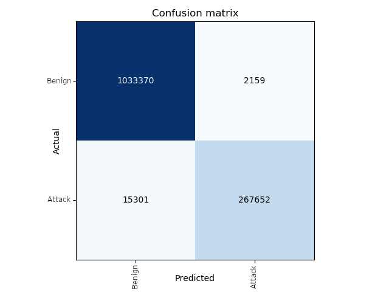
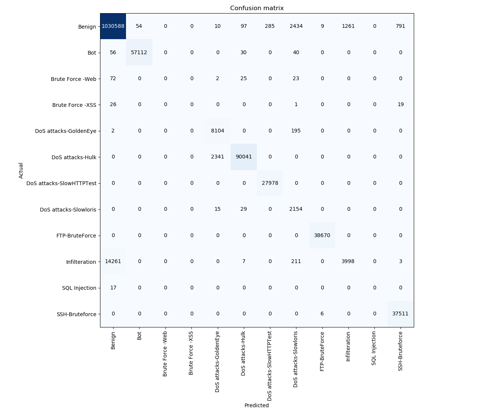

# Deep Learning - IDS

Towards Developing a Network Intrusion Detection System using Deep Learning Techniques
- Published article: http://isyou.info/jisis/vol9/no4/jisis-2019-vol9-no4-01.pdf

## Introduction

In this project, we aim to explore the capabilities of various deep-learning frameworks in detecting
and classifying network intursion traffic with an eye towards designing a ML-based intrusion detection system.

## Dataset

-   Downloaded from: https://www.unb.ca/cic/datasets/ids-2018.html
-   contains: 7 csv preprocessed and labelled files, top feature selected files, original traffic data in pcap format and logs
-   used csv preprocessed and labelled files for this research project

## Data Cleanup

-   dropped rows with Infinitiy values
-   some files had repeated headers; dropped those
-   converted timestamp value that was date time format: 15-2-2018 to UNIX epoch since 1/1/1970
-   separated data based on attack types for each data file
-   ~20K rows were removed as a part of data cleanup
-   see data_cleanup.py script for this phase
-   \# Samples in table below are total samples left in each dataset after dropping # Dropped rows/samples

## Dataset Summary

| File Name      | Traffic Type     | # Samples | # Dropped |
| -------------- | ---------------- | --------: | :-------- |
| 02-14-2018.csv | Benign           |   663,808 | 3818      |
|                | FTP-BruteForce   |   193,354 | 6         |
|                | SSH-Bruteforce   |   187,589 | 0         |
| 02-15-2018.csv | Benign           |   988,050 | 8027      |
|                | DOS-GoldenEye    |    41,508 | 0         |
|                | DOS-Slowloris    |    10,990 | 0         |
| 02-16-2018.csv | Benign           |   446,772 | 0         |
|                | Dos-SlowHTTPTest |   139,890 | 0         |
|                | DoS-Hulk         |   461,912 | 0         |
| 02-22-2018.csv | Benign           | 1,042,603 | 5610      |
|                | BruteForce-Web   |       249 | 0         |
|                | BruteForce-XSS   |        79 | 0         |
|                | SQL-Injection    |        34 | 0         |
| 02-23-2018.csv | Benign           | 1,042,301 | 5708      |
|                | BruteForce-Web   |       362 | 0         |
|                | BruteForce-XSS   |       151 | 0         |
|                | SQL-Injection    |        53 | 0         |
| 03-01-2018.csv | Benign           |   235,778 | 2259      |
|                | Infiltration     |    92,403 | 660       |
| 03-02-2018.csv | Benign           |   758,334 | 4050      |
|                | BotAttack        |   286,191 | 0         |

| Traffic Type     | # Samples |
| ---------------- | --------: |
| Benign           | 5,177,646 |
| FTP-BruteForce   |   193,354 |
| SSH-BruteForce   |   187,589 |
| DOS-GoldenEye    |    41,508 |
| Dos-Slowloris    |    10,990 |
| Dos-SlowHTTPTest |   139,890 |
| Dos-Hulk         |   461,912 |
| BruteForce-Web   |       611 |
| BruteForce-XSS   |       230 |
| SQL-Injection    |        87 |
| Infiltration     |    92,403 |
| BotAttack        |   286,191 |
| Total Attack     | 1,414,765 |

## Deep Learning Frameworks

-   perfomance results using various deep learning frameworks are compared
-   10-fold cross-validation techniques was used to validate the model

### FastAI

-   https://www.fast.ai/
-   uses PyTorch, https://pytorch.org/ as the backend

### Keras

-   https://keras.io/
-   using TensorFlow and Theano as backend
-   https://www.TensorFlow.org/
-   https://github.com/Theano/Theano

## Experiment Results

### Using Salamander.ai

| Dataset     | Framework         | Accuracy (%) | Std-Dev | GPU Time (~mins) |
| ----------- | ----------------- | -----------: | ------: | ---------------: |
| 02-14-2018  | FastAI            |        99.85 |    0.07 |               \* |
|             | Keras-TensorFlow  |        98.80 |      \* |               \* |
|             | Keras-Theano      |           \* |      \* |               \* |
| 02-15-2018  | FastAI            |        99.98 |    0.01 |               25 |
|             | Keras-Tensorfflow |        99.32 |      \* |               \* |
|             | Keras-Theano      |           \* |      \* |               \* |
| 02-16-2018  | FastAI            |       100.00 |    0.00 |               16 |
|             | Keras-TensorFlow  |        99.84 |      \* |               \* |
|             | Keras-Theano      |           \* |      \* |               \* |
| 02-22-2018  | FastAI            |        99.87 |    0.15 |              110 |
|             | Keras-TensorFlow  |        99.97 |      \* |               \* |
|             | Keras-Theano      |           \* |      \* |               \* |
| 02-23-2018  | FastAI            |        99.92 |    0.00 |              120 |
|             | Keras-TensorFlow  |        99.94 |      \* |               \* |
|             | Keras-Theano      |           \* |      \* |               \* |
| 03-01-2018  | FastAI            |        87.00 |    0.00 |                5 |
|             | Keras-TensorFlow  |        72.20 |      \* |               \* |
|             | Keras-Theano      |           \* |      \* |               \* |
| 03-02-2018  | FastAI            |        99.97 |     .01 |               75 |
|             | Keras-TensorFlow  |        98.12 |      \* |               \* |
|             | Keras-Theano      |           \* |      \* |               \* |
| ===         | ===               |          === |     === |              === |
| Multiclass  | Keras-TensorFlow  |        94.73 |      \* |               \* |
|             | Keras-Theano      |           \* |      \* |               \* |
|             | FastAI            |           \* |      \* |               \* |
| Binaryclass | Keras-TensorFlow  |        94.40 |      \* |               \* |
|             | Keras-Theano      |           \* |      \* |               \* |
|             | FastAI            |           \* |      \* |               \* |

### FastAI Results

#### Summary Results

| Data File                  | Accuracy |    Loss |
| -------------------------- | -------: | ------: |
| 02-14-2018.csv             |   99.99% | 0.00212 |
| 02-15-2018.csv             |   99.86% | 0.02500 |
| 02-16-2018.csv             |   99.97% |  324160 |
| 02-22-2018.csv             |   99.97% | 0.00221 |
| 02-23-2018.csv             |   99.82% | 0.06295 |
| 03-01-2018.csv             |   87.14% | 0.37611 |
| 03-02-2018.csv             |   99.72% | 0.85127 |
| IDS-2018-binaryclass.csv\* |   98.68% | 0.37692 |
| IDS-2018-multiclass.csv\*  |   98.31% | 7.06169 |

\* Trained on VMgpu

#### Confusion Matrices

|                          02-14-2018                          |                             02-15-2018                             |                            02-16-2018                             |
| :----------------------------------------------------------: | :----------------------------------------------------------------: | :---------------------------------------------------------------: |
| .png>) |    .png>)    |   .png>)    |
|                          02-22-2018                          |                             02-23-2018                             |                            03-01-2018                             |
| .png>) |    .png>)    |   .png>)    |
|                          03-02-2018                          |                        IDS-2018-binaryclass                        |                        IDS-2018-multiclass                        |
| .png>) |  |  |

### Attack Sample Distribution and Detection Accuracy

| Data File     | % of Attack Samples | % Attacks Flagged Correctly | % Benign Flagged Incorrectly |
| ------------- | ------------------: | --------------------------: | ---------------------------: |
| 02-14-2018    |               36.46 |                      100.00 |                       0.00\* |
| 02-15-2018    |                5.04 |                       99.85 |                       0.00\* |
| 02-16-2018    |               57.39 |                      100.00 |                       0.00\* |
| 02-22-2018    |              0.00\* |                        0.02 |                         0.00 |
| 02-23-2018    |              0.00\* |                       61.61 |                       0.00\* |
| 03-01-2018    |               28.16 |                       73.19 |                        10.16 |
| 03-02-2018    |               27.40 |                       99.85 |                       0.00\* |
| Binary-Class  |                  21.50 |                          94.60 |                           0.21 |
| Multi-Class   |                  21.50 |                          93.9 |                           0.48 |

\* Small, non-zero values

### Using VMgpu

| Dataset     | Framework        | Accuracy (%) | Std-Dev | GPU Time (~mins) |
| ----------- | ---------------- | :----------: | :-----: | :--------------: |
| 02-14-2018  | FastAI           |    99.54     |  0.32   |      100.36      |
|             | Keras-TensorFlow |    99.14     |   \*    |      100.29      |
|             | Keras-Theano     |    98.58     |   \*    |        \*        |
| 02-15-2018  | FastAI           |    99.98     |  0.01   |      103.16      |
|             | Keras-TensorFlow |    99.33     |   \*    |      96.34       |
|             | Keras-Theano     |    99.17     |   \*    |        \*        |
| 02-16-2018  | FastAI           |    99.66     |  0.25   |      104.51      |
|             | Keras-TensorFlow |    99.66     |   \*    |      99.59       |
|             | Keras-Theano     |    99.41     |   \*    |        \*        |
| 02-22-2018  | FastAI           |    99.90     |  0.09   |      102.83      |
|             | Keras-TensorFlow |    99.97     |   \*    |      96.71       |
|             | Keras-Theano     |    99.97     |   \*    |        \*        |
| 02-23-2018  | FastAI           |    99.88     |  0.08   |      104.43      |
|             | Keras-TensorFlow |    95.95     |   \*    |      100.79      |
|             | Keras-Theano     |    99.95     |   \*    |        \*        |
| 03-01-2018  | FastAI           |    86.47     |  0.78   |      33.23       |
|             | Keras-TensorFlow |    72.16     |   \*    |      33.15       |
|             | Keras-Theano     |    72.04     |   \*    |        \*        |
| 03-02-2018  | FastAI           |    99.94     |  0.04   |      104.34      |
|             | Keras-TensorFlow |    98.47     |   \*    |      105.95      |
|             | Keras-Theano     |    93.95     |   \*    |        \*        |
| ===         | ===              |     ===      |   ===   |       ===        |
| Multiclass  | FastAI           |    98.60     |  0.16   |      683.12      |
|             | Keras-TensorFlow |    92.09     |   \*    |      652.89      |
|             | Keras-Theano     |      \*      |   \*    |        \*        |
| Binaryclass | FastAI           |    98.75     |  0.05   |      675.98      |
|             | Keras-TensorFlow |    95.14     |   \*    |      632.36      |
|             | Keras-Theano     |      \*      |   \*    |        \*        |

### fastai CPU vs GPU training time on vmGPU

| Dataset     | Hardware | Accuracy (%) | Time (~mins) |
| ----------- | -------- | :----------: | :----------: |
| 02-14-2018  |          |              |              |
|             | CPU      |     99.86    |   1193.84    |
|             | GPU      |     99.54    |    100.36    |
| 02-15-2018  |          |              |              |
|             | CPU      |     99.93    |    1299.55   |
|             | GPU      |     99.89    |    103.16    |
| 02-16-2018  |          |              |              |
|             | CPU      |     99.88    |    433.63    |
|             | GPU      |     99.66    |    104.51    |
| 02-22-2018  |          |              |              |
|             | CPU      |     99.83    |   3091.34    |
|             | GPU      |     99.90    |    102.83    |
| 02-23-2018  |          |              |              |
|             | CPU      |     99.83    |   1938.74    |
|             | GPU      |     99.88    |    104.43    |
| 03-01-2018  |          |              |              |
|             | CPU      |     85.39    |    80.07     |
|             | GPU      |     86.47    |    33.23     |
| 03-02-2018  |          |              |              |
|             | CPU      |     99.76    |   1503.18    |
|             | GPU      |     99.94    |    104.34    |
| ===         | ===      | ===          |     ===      |
| Multiclass  |          |              |              |
|             | CPU      |     96.63    |  19361.95    |
|             | GPU      |     98.60    |    683.12    |
| Binaryclass |          |              |              |
|             | CPU      |     96.66    |  19441.55    |
|             | GPU      |     98.75    |    632.36    |

# References

1. Iman Sharafaldin, Arash Habibi Lashkari, and Ali A. Ghorbani, “Toward Generating a New Intrusion Detection Dataset and Intrusion Traffic Characterization”, 4th International Conference on Information Systems Security and Privacy (ICISSP), Portugal, January 2018
